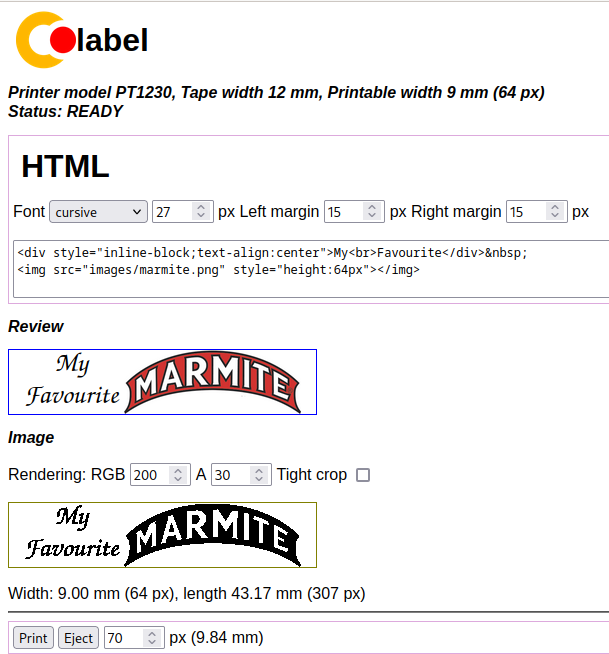

# clabel-js
Support for a Brother P-Touch 1230PC label printer (and potentially
other - untested - Brother P-Touch printers), with a simple browser-based
UI that lets you design complex labels using HTML).

# Example


# Usage
Run the server on the machine where the printer is connected. Change
directory to the 'server' subdirectory and:
```
node bin/server.js
```
Run it with -h for help.

Load the UI in a browser using `localhost:9094`.

The UI is used to compose an image of the label that is to be
printed. You are shown what the label will look like when it is printed.
